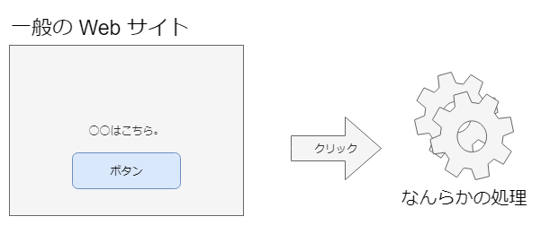
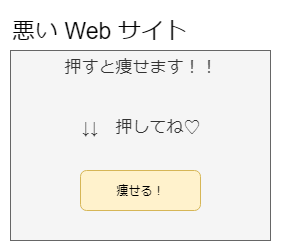
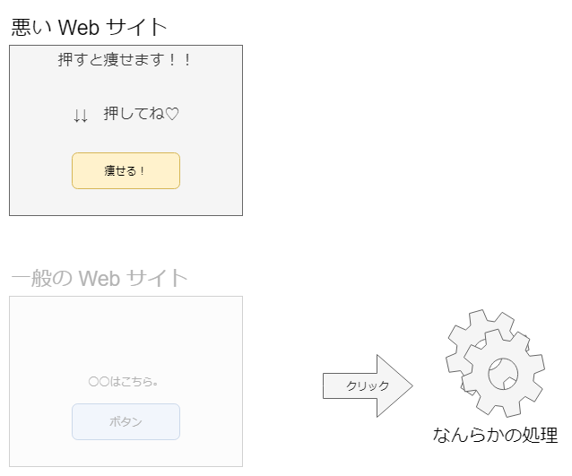
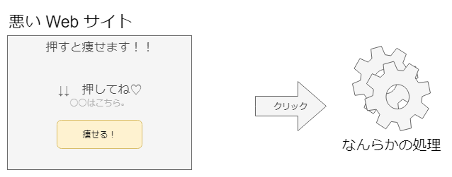
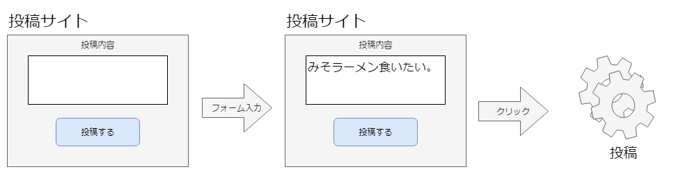
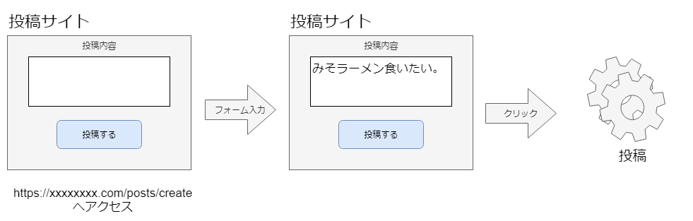
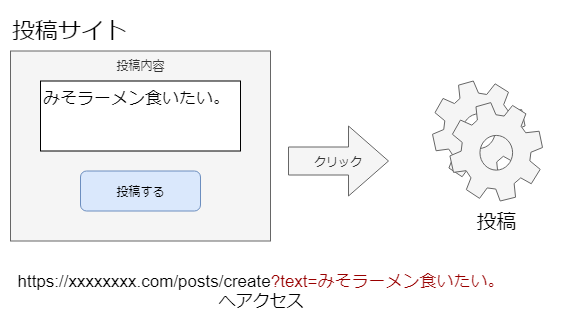
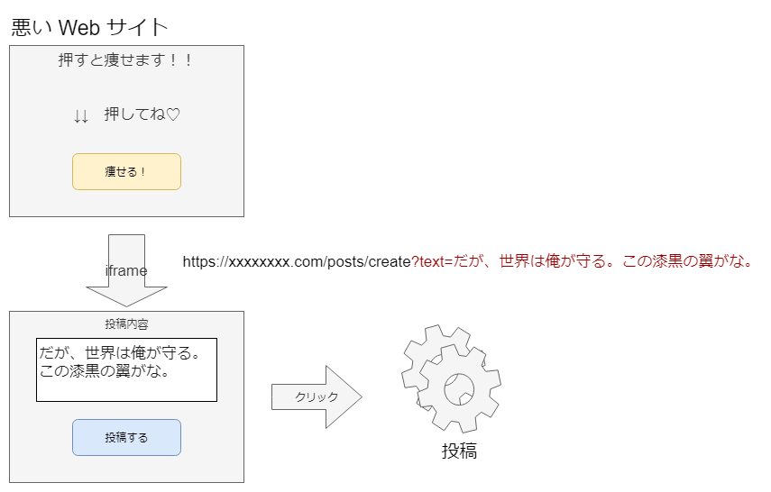
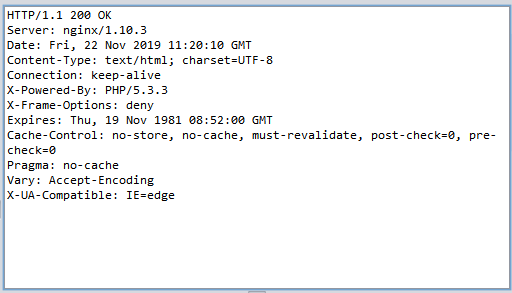

## Webアプリケーションの機能別に見るセキュリティバグ
~「重要な処理」の際に混入する脆弱性~

--

### 自己紹介

- 名前：今村昌平
- 職業：システムエンジニア（3年目）
- 言語：PHP, Laravel

--

### 本ドキュメントについて

- Weeyble 勉強会のための資料です
- 権利関係で問題がありましたら、ご連絡ください
- reveal.js で作成しています
- スライドは[こちら](https://shoheiimamura.github.io/secure_web_apps_4.5/#/)からアクセスできます。

---

### クリックジャッキングのプロセス

1. 悪いサイトにアクセス
2. サイト内のなにかをクリック
3. 別サービスの処理が実行！？

--

### クリックジャッキング図解（１）

ボタンを押下すると何らかの処理が実行される



--

### クリックジャッキング図解（２）

悪いサイトには、押したくなるボタンを設置



--

### クリックジャッキング図解（３）

悪いサイトは、裏で一般のサイトをこっそり呼び出す



--

### クリックジャッキング図解（４）

一般サイトをこっそり手前に重ねて表示する  



ボタン押すと一般サイトの処理実行

--

### クリックジャッキング図解（５）

ボタンを一回押しただけで、大事な処理になることって？


--

### クリックジャッキング図解（６）

普通はフォーム入力をしてから、ボタン押下



--

### クリックジャッキング図解（７）

入力ページへのアクセス



--

### クリックジャッキング図解（８）

入力ページへのアクセスを工夫すると



--

### クリックジャッキング図解（９）

つまり、ボタンを１クリックしただけで処理ができる



--

### クリックジャッキングまとめ

- クリックジャッキングの影響
  - 利用者に悟らせずに、重要な処理を実施
- クリックジャッキングの発生原理
  - iframeによる対象サイト呼び出し＆透明化
- クリックジャッキングの対策
  - X-Frame-Optionsを設定
  - 処理時にメール飛ばす（保険的対策）

---

#### ウェブインテント機能

- クエリ文字列にフォーム内容を予め指定
  - Twitter の投稿機能


--

#### ウェブインテント機能の利用例

サンプル（./sample/45-010a.php）

```php
<?php
  $msg = '';
  // クエリパラメータをメッセージとして取得する
  if (!empty($_GET['intent'])) {
    $msg = $_GET['intent'];
  }
?>

// メッセージ初期表示
<textarea cols="40" name="msg"><?php ex($msg); ?></textarea>
```

--

### ウェブインテント機能を有するサイト

- 通常のアクセス
  - [http://example.jp/45/45-010.php?](http://example.jp/45/45-010.php?)

- ウェブインテント機能を利用したアクセス
  - [http://example.jp/45/45-010.php?intent=wasbook小学校を襲撃します。](http://example.jp/45/45-010.php?intent=wasbook小学校を襲撃します。)

--

### 罠サイト

- 一見、対象サイトとは無関係
- 実は、iframe で対象サイトをこっそり表示

--

### 罠サイトサンプル

[http://trap.example.com/45/45-910.html](http://trap.example.com/45/45-910.html)

--

### 罠サイトソース

サンプル(./sample/45-910.html)

```html
<div style="position: absolute; top:35; left:5; z-index:0;">クリックしてスマートフォンを当てよう</div>
<!-- iframe で対象サイトを表示 -->
<iframe id="wana" style="position: absolute; top:0; left:0; z-index:5; opacity:0.5;" width=400 height=150 frameborder="0" src="http://example.jp/45/45-010.php?intent=wasbook%E5%B0%8F%E5%AD%A6%E6%A0%A1%E3%82%92%E8%A5%B2%E6%92%83%E3%81%97%E3%81%BE%E3%81%99"></iframe>
<div style="position: absolute; top:10; left:420;">
```

--

### クリックジャッキングの原因

- アプリケーションバグではない
- ifram で好き勝手参照されるのがマズイ

--

### X-Frame-Options

- iframe の参照を制限
- 主要ブラウザ最新版では対応
- レスポンスヘッダに出力



--

### X-Frame-Options の設定

| 設定       | 挙動                       |
|------------|----------------------------|
| DENY       | iframeの内側で表示されない |
| SAMEORIGIN | 同一オリジンの場合のみ表示 |

--

### X-Frame-Options の設定例

```
# Apache
Header always append X-Frame-Optioins SAMEORGIN

# nginx
add_header X-Frame-Options SAMEORIGIN;
```

--

### X-Frame-Options の対策サイト

- 未対策
  - [http://trap.example.com/45/45-910.html](trap.example.com/45/45-910.html)
- 対策済
  - [http://trap.example.com/45/45-910a.html](http://trap.example.com/45/45-910a.html)

--

### X-Frame-Options の対策サイト html

未対策

```html
<iframe>
    <html><head></head><body style="background-color: #FFFFFF">
    yamadaさん、投稿をどうぞ<br>
    <form action="45-011.php" method="post">
        <textarea cols="40" name="msg">wasbook小学校を襲撃します</textarea><br>
        <input type="hidden" name="token" value="75c400fe8c0010d73dbe84c16596c2d4c2b6c52b1eaa2b7d">
        <input type="submit" value="投稿">
    </form>
    </body></html>
</iframe>
```

対策済

```html
<iframe>
</iframe>
```

---

### 保険的対策

- 重要な処理実行時にメール送信
  - 重要な処理自体を防ぐのは難しい
  - 即座に気づけば、被害は最小限

--

### クリックジャッキングまとめ（再掲）

- クリックジャッキングの影響
  - 利用者に悟らせずに、重要な処理を実施
- クリックジャッキングの発生原理
  - ウェブインテント機能
  - iframeによる対象サイト呼び出し＆透明化
- クリックジャッキングの対策
  - X-Frame-Optionsを設定
  - 処理時にメール飛ばす（保険的対策）
